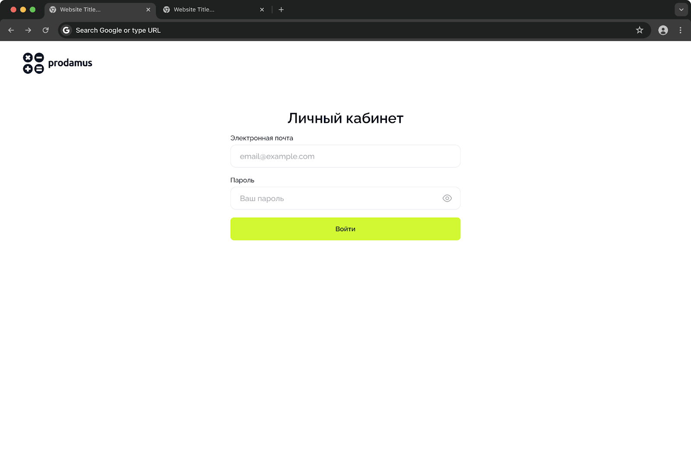

---
layout:
  width: default
  title:
    visible: true
  description:
    visible: false
  tableOfContents:
    visible: true
  outline:
    visible: true
  pagination:
    visible: true
  metadata:
    visible: true
  tags:
    visible: true
---

# Как авторизоваться в личном кабинете Prodamus

Чтобы войти в личный кабинет Prodamus, следуйте инструкции описанной ниже.

### Шаг 1. Откройте страницу авторизации

Перейдите на страницу авторизации личного кабинета Prodamus. 

1. На экране появится форма авторизации с полями для ввода электронной почты и пароля.
2. Введите электронную почту, которую вы использовали при подключении и пароль в соответствующие поля.
3. Нажмите кнопку «Войти».

<figure><figcaption></figcaption></figure>

Если вы забыли логин или пароль, доступ к личному кабинету можно восстановить.

👉 [Как восстановить пароль от личного кабинета](https://help.prodamuspay.ru/vkhod-v-lichnyi-kabinet/kak-vosstanovit-parol-ot-lichnogo-kabineta)

### Шаг 2. Введите двухэтапный код

После нажатия кнопки «Войти» система может запросить ввод 4-значного кода для подтверждения авторизации. Этот код был отправлен на вашу электронную почту. 

1. Откройте почтовый ящик, указанный при регистрации.
2. Найдите письмо с 4-значным кодом.
3. Введите полученный код в поле на странице входа.

<figure><figcaption></figcaption></figure>

Готово, теперь вы можете начать работать с вашей платёжной страницей и использовать все функции личного кабинета.
