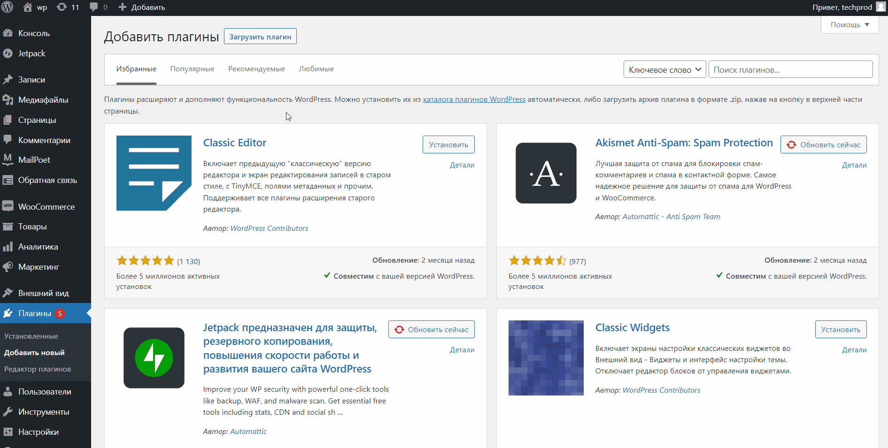

# Wordpress

Если ваш сайт сделан на WordPress, вы можете подключить к нему возможность оплачивать заказы через Prodamus. Ниже — инструкция, как всё настроить.

### Шаг 1. Установите плагин WooCommerce 

Он понадобится, чтобы подключить к сайту возможность совершать оплату через Prodamus. Чтобы установить плагин, авторизуйтесь в личном кабинете WordPress, выберите вкладку «Плагины» и нажмите «Добавить новый».

<figure><figcaption></figcaption></figure>

Откройте вкладку «Популярные», выберите плагин WooCommerce и нажмите «Установить».

<figure><figcaption></figcaption></figure>

### Шаг 2. Установите плагин оплаты Prodamus 

Для этого сначала скачайте файл с плагином себе на компьютер.



Затем в личном кабинете WordPress откройте раздел «Плагины» и нажмите «Добавить новый».

<figure><figcaption></figcaption></figure>

Нажмите «Загрузить плагин», загрузите файл с плагином и установите его в WordPress.

<figure><figcaption></figcaption></figure>

### Шаг 3. Настройте оплату 

Для этого выберите вкладку «WooCommerce» и нажмите на «Настройки».

<figure><figcaption></figcaption></figure>

Откройте вкладку «Платежи», включите оплату через плагин Prodamus и нажмите на «Управление».

<figure><figcaption></figcaption></figure>

Включите «Активность способа оплаты», чтобы активировать для клиентов оплату через Prodamus.

<figure><figcaption></figcaption></figure>

Придумайте название и описание способа оплаты.

<figure><figcaption></figcaption></figure>

Укажите в поле «Адрес платёжной страницы» ссылку на вашу платёжную страницу.

<figure><figcaption></figcaption></figure>

Вставьте секретный ключ. Его можно найти [в личном кабинете Prodamus](https://help.prodamuspay.ru/~/revisions/4aZT2HbxT10S1SYWoSW0/kanaly-prodazh/integracii/kak-sozdat-sekretnyi-klyuch-dlya-podklyucheniya-integracii)

<figure><figcaption></figcaption></figure>

Для корректной работы плагина обязательно установите следующие настройки статусов:

* «Статус заказа» → «В обработке».
* «Статус заказа, из которого можно переходить к оплате» → «Ожидается оплата».

<figure><figcaption></figcaption></figure>

Укажите в поле «URL-адрес для возврата пользователя без оплаты» ссылку, по которой будут направляться клиенты при неудачной оплате заказа.

<figure><figcaption></figcaption></figure>

Укажите в поле «URL-адрес для возврата пользователя при успешной оплате» ссылку, по которой будут направляться клиенты при успешной оплате заказа.

<figure><figcaption></figcaption></figure>

Выберите валюту, в которой будут оплачиваться заказы.

<figure><figcaption></figcaption></figure>

Нажмите «Сохранить изменения».

<figure><figcaption></figcaption></figure>

### Шаг 4. Установите для каждого товара доступные методы оплаты 

Перейдите в раздел «Товары».

<figure><figcaption></figcaption></figure>

Откройте товар, для которого вы хотите подключить или отключить методы оплаты.

<figure><figcaption></figcaption></figure>

Проскорольте страницу вниз и отметьте галочками методы оплаты, которые будут доступны клиентам при покупке продукта.

<figure><figcaption></figcaption></figure>

Нажмите «Обновить», чтобы сохранить изменения.

<figure><figcaption></figcaption></figure>

Готово! Интеграция настроена. Теперь, когда клиент перейдёт в корзину, укажет свои контактные данные и нажмёт на кнопку оформления заказа, откроется платёжная страница Prodamus — и покупателю останется выбрать способ оплаты и оплатить покупку.
