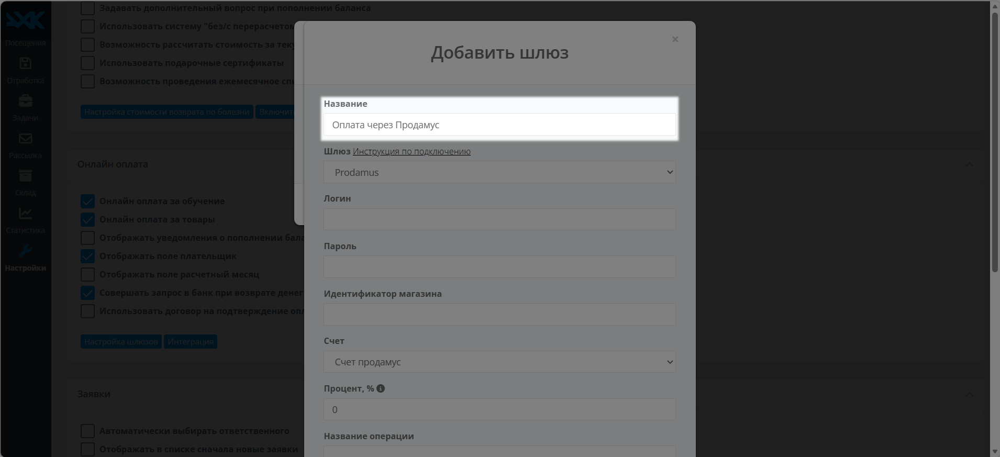
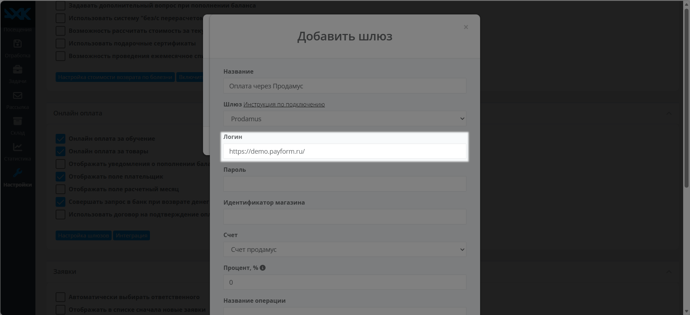
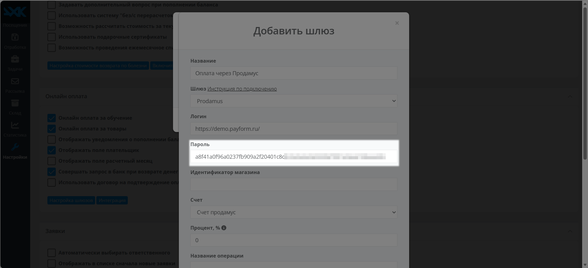
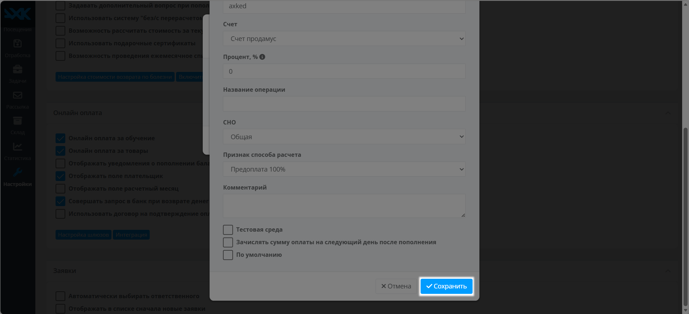

# Axked

**AXKED** — это CRM-система для управления учебными центрами, клубами и школами, объединяющая расписание, финансы, посещаемость и методическую базу. Вы можете вести учет учеников прямо из браузера без Excel и бумажных журналов: настраивать группы и расписание, отмечать посещения с оценками, принимать онлайн-оплату, отправлять E-mail и СМС-рассылки должникам, а также анализировать рентабельность и отток учеников. Система интегрируется с вашим сайтом и подходит для франшиз. Ниже — инструкция по настройке.

## 1. Собираем данные и производим настройки на стороне Продамуса.

👉 [Инструкция: как авторизоваться на платёжной странице](https://help.prodamuspay.ru/)

Для настроек в системе Axked нам понадобятся данные:\
Адрес платежной страницы:

* Откройте канал продаж, который хотите интегрировать с Axked&#x20;
* Скопируйте адрес платежной страницы

<figure><figcaption></figcaption></figure>

Секретный ключ вашей формы:

* Откройте канал продаж, который хотите интегрировать с Axked
* Перейдите в раздел «Интеграции»&#x20;
* Нажмите сгенерировать ключ

<figure><figcaption></figcaption></figure>

Скопируйте и сохраните сгенерированный ключ.


**Обратите внимание!** После закрытия модального окна просмотр ключа будет недоступен.&#x20;


<figure><figcaption></figcaption></figure>


Если у вас уже настроен адрес для уведомлений об оплате на другой url, то этот блок можно пропустить и сразу перейти к следующему шагу настройки интеграции


Далее добавим в наш платежный кабинет - URL адрес для уведомлений об оплате.

Откройте нужный канал продаж и перейдите в раздел «Уведомления».

<figure><figcaption></figcaption></figure>

* Включите тумблер «Уведомления о разовых оплатах».&#x20;
* Вставьте адрес [https://axked.ru/api/pay-online-done/](https://axked.ru/api/pay-online-done/)
* Поставьте галочку в поле «Заказ оплачен»
* Сохраните изменения.

<figure><figcaption></figcaption></figure>

### 2. Настройки платежного метода на стороне Axked

Перейдите на страницу «Настройки», найдите блок «Онлайн оплата» и нажмите кнопку «Настройка шлюзов»

<figure><figcaption></figcaption></figure>

Нажмите кнопку «Добавить»

<figure><figcaption></figcaption></figure>

В поле «Шлюз» выберите «Prodamus»

<figure><figcaption></figcaption></figure>

Добавьте название платежного шлюза

<figure><figcaption></figcaption></figure>

В поле «Логин» вставьте адрес вашей платежной страницы

<figure><figcaption></figcaption></figure>

В поле «Пароль» вставьте секретный ключ, полученный в личном кабинете Prodamus

<figure><figcaption></figcaption></figure>

Сохраните настройки

<figure><figcaption></figcaption></figure>

Готово: интеграция настроена — и теперь ваши покупатели смогут оплачивать товары через Axked
