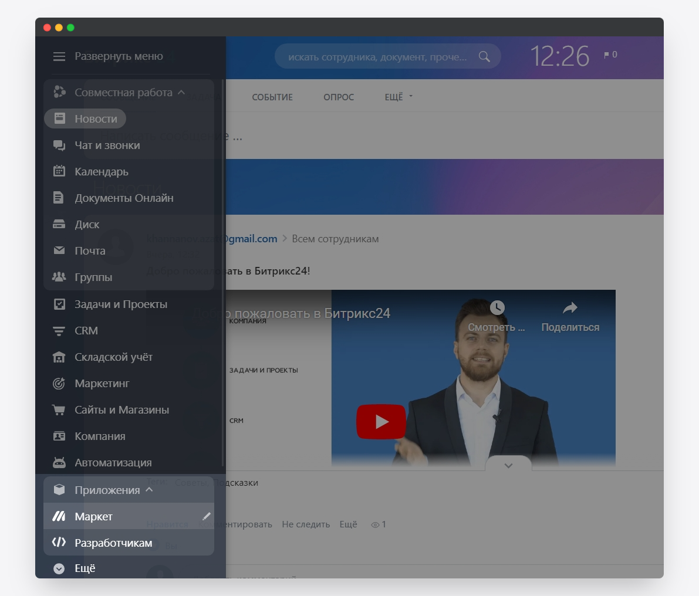
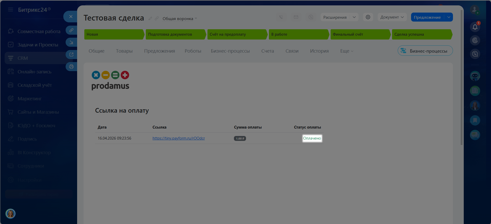

# Битрикс24

**Битрикс24** — это единое рабочее пространство, объединяющее CRM, мессенджер, задачи, проекты, сайты и ИИ-помощника для управления бизнесом. Вы можете настроить систему прямо в браузере без сложной интеграции: автоматизировать продажи и маркетинг, строить сквозную аналитику, создавать сайты и магазины через конструктор, управлять распределенными командами и документооборотом. Платформа интегрируется с 1С, телефонией, платежными системами и сотнями других сервисов через API. Ниже — инструкция по настройке.

### 1. Собираем данные на стороне Продамуса.

👉 [Инструкция: как авторизоваться на платёжной странице](https://help.prodamuspay.ru/)

Для настроек в системе Битрикс24 нам понадобятся данные:\
1\) Адрес платежной страницы:

* Откройте канал продаж, который хотите интегрировать с Битрикс24
* Скопируйте адрес платежной страницы

<figure><figcaption></figcaption></figure>

2\) Секретный ключ вашей формы:

* Откройте канал продаж, который хотите интегрировать с Битрикс24
* Перейдите в раздел «Интеграции»&#x20;
* Нажмите сгенерировать ключ

<figure><figcaption></figcaption></figure>

Скопируйте и сохраните сгенерированный ключ.


**Обратите внимание!** После закрытия модального окна просмотр ключа будет недоступен.&#x20;


<figure><figcaption></figcaption></figure>

### Шаг 2. Установите в «Битрикс24» приложение Prodamus 

Для этого на левой панели выберите «Приложения» и перейдите в раздел «Маркет».

<figure><figcaption></figcaption></figure>

Введите в поисковой строке «Prodamus».

<figure><figcaption></figcaption></figure>

Выберите приложение «Prodamus / Продамус» и нажмите «Установить».

<figure><figcaption></figcaption></figure>

Подтвердите своё согласие с:

* правилами использования каталога решений;
* лицензионным соглашением;
* политикой конфиденциальности.

Нажмите «Установить».

<figure><figcaption></figcaption></figure>

Нажмите «Открыть приложение».

<figure><figcaption></figcaption></figure>

### Шаг 3. Настройте приложение 

**Настройки для вкладки «Магазины».** Нажмите «Добавить магазин».

<figure><figcaption></figcaption></figure>

Укажите название магазина.

<figure><figcaption></figcaption></figure>

Впишите в поле «Поддомен в Prodamus» ссылку на вашу платёжную страницу.

<figure><figcaption></figcaption></figure>


**Важно!** Для корректной работы интеграции, ссылка не должна содержать протокол «https://».

* ✅ demo.payform.ru&#x20;
* ❌ https://www.demo.payform.ru


Вставьте секретный ключ, ранее скопированный из личного кабинета Prodamus.

<figure><figcaption></figcaption></figure>

Укажите методы оплаты, которые будут доступны клиентам при оформлении.


В поле «Доступные методы оплаты» необходимо передавать коды методов оплаты, разделяя их вертикальной чертой. Например AC|SBP


Доступные методы оплат

| Название метода                                  | Код метода                                            |
| ------------------------------------------------ | ----------------------------------------------------- |
| Open banking, Онлайн банкинг Европы              | yottapay                                              |
| SberPay                                          | sbol                                                  |
| T-PAY                                            | tpay                                                  |
| Visa/Mastercard, EUR                             | overpayeur                                            |
| Visa/MasterCard/МИР, RUB                         | AC                                                    |
| WB кошелек                                       | wbpay                                                 |
| Банковская карта                                 | ACkztjp                                               |
| Быстрый платеж                                   | SBP                                                   |
| В кредит от Фреш Кредит                          | fresh\_credit                                         |
| В рассрочку от Фреш Кредит на 10 месяцев         | fresh\_installment\_0\_0\_10                          |
| В рассрочку от Фреш Кредит на 12 месяцев         | fresh\_installment\_0\_0\_12                          |
| В рассрочку от Фреш Кредит на 18 месяцев         | fresh\_installment\_0\_0\_18                          |
| В рассрочку от Фреш Кредит на 24 месяца          | fresh\_installment\_0\_0\_24                          |
| В рассрочку от Фреш Кредит на 36 месяцев         | fresh\_installment\_0\_0\_36                          |
| В рассрочку от Фреш Кредит на 6 месяцев          | fresh\_installment\_0\_0\_6                           |
| Кредит от Т-Банка                                | credit                                                |
| Кредит от Т-Банка                                | TINKOFF\_API\_CREDIT                                  |
| Оплата в EUR                                     | ACEURGV                                               |
| Оплата в EUR                                     | ACEURKB                                               |
| Оплата в EUR                                     | ACeurxp                                               |
| Оплата в GBP                                     | ACGBPGV                                               |
| Оплата в USD                                     | ACUSDGV                                               |
| Оплата в USD                                     | ACUSDKB                                               |
| Оплата в USD                                     | ACusdxp                                               |
| Оплата в рассрочку Долями                        | dolyame:installment                                   |
| Оплата в рублях                                  | AC                                                    |
| Оплата в тенге                                   | ACf                                                   |
| Оплата в тенге                                   | ACkz                                                  |
| Оплата картой, кроме РФ                          | MONETAWORLD                                           |
| Оплата частями "Давай делить"                    | davay\_delit                                          |
| Плати Частями                                    | sbrf\_bnpl                                            |
| Рассрочка ВсегдаДа  на 10 месяцев                | vsegdada\_installment\_0\_0\_10                       |
| Рассрочка ВсегдаДа  на 12 месяцев                | vsegdada\_installment\_0\_0\_12                       |
| Рассрочка ВсегдаДа на 18 месяцев                 | vsegdada\_installment\_0\_0\_18                       |
| Рассрочка ВсегдаДа  на 24 месяца                 | vsegdada\_installment\_0\_0\_24                       |
| Рассрочка ВсегдаДа на 3 месяца                   | vsegdada\_installment\_0\_0\_3                        |
| Рассрочка ВсегдаДа  на 36 месяцев                | vsegdada\_installment\_0\_0\_36                       |
| Рассрочка ВсегдаДа на 4 месяца                   | vsegdada\_installment\_0\_0\_4                        |
| Рассрочка ВсегдаДа  на 6 месяцев                 | vsegdada\_installment\_0\_0\_6                        |
| Кредит ВсегдаДа  на 12 месяцев                   | vsegdada\_creditline\_0\_0\_12                        |
| Кредит ВсегдаДа на 10 месяцев                    | vsegdada\_creditline\_0\_0\_10                        |
| Кредит ВсегдаДа  на 24 месяца                    | vsegdada\_creditline\_0\_0\_24                        |
| Кредит ВсегдаДа на 3 месяца                      | vsegdada\_creditline\_0\_0\_3                         |
| Кредит ВсегдаДа на 4 месяца                      | vsegdada\_creditline\_0\_0\_4                         |
| Кредит ВсегдаДа на 6 месяцев                     | vsegdada\_creditline\_0\_0\_6                         |
| Рассрочка от ProOnline на 12 месяцев             | proonline\_installment\_0\_0\_12                      |
| Рассрочка от ProOnline на 12 месяцев. Казахстан  | proonline\_installment\_kz\_0\_0\_12                  |
| Рассрочка от ProOnline на 12 месяцев. Кыргызстан | proonline\_installment\_0\_0\_12                      |
| Рассрочка от ProOnline на 18 месяцев             | proonline\_installment\_0\_0\_18                      |
| Рассрочка от ProOnline на 18 месяцев. Казахстан  | proonline\_installment\_kz\_0\_0\_18                  |
| Рассрочка от ProOnline на 18 месяцев. Кыргызстан | proonline\_installment\_0\_0\_18                      |
| Рассрочка от ProOnline на 24 месяца              | proonline\_installment\_0\_0\_24                      |
| Рассрочка от ProOnline на 24 месяца. Казахстан   | proonline\_installment\_kz\_0\_0\_24                  |
| Рассрочка от ProOnline на 24 месяца. Кыргызстан  | proonline\_installment\_0\_0\_24                      |
| Рассрочка от ProOnline на 6 месяцев              | proonline\_installment\_0\_0\_6                       |
| Рассрочка от ProOnline на 6 месяцев. Казахстан   | proonline\_installment\_kz\_0\_0\_6                   |
| Рассрочка от ProOnline на 6 месяцев. Кыргызстан  | proonline\_installment\_0\_0\_6                       |
| Рассрочка от Банков-партнёров на 10 месяцев      | direct\_installment\_0\_0\_10                         |
| Рассрочка от Банков-партнёров на 12 месяцев      | direct\_installment\_0\_0\_12                         |
| Рассрочка от Банков-партнёров на 18 месяцев      | direct\_installment\_0\_0\_18                         |
| Рассрочка от Банков-партнёров на 24 месяца       | direct\_installment\_0\_0\_24                         |
| Рассрочка от Банков-партнёров на 3 месяца        | direct\_installment\_0\_0\_3                          |
| Рассрочка от Банков-партнёров на 36 месяцев      | direct\_installment\_0\_0\_36                         |
| Рассрочка от Банков-партнёров на 6 месяцев       | direct\_installment\_0\_0\_6                          |
| Рассрочка от Т-Банка                             | installment\_0\_0\_10                                 |
| Рассрочка от Т-Банка                             | installment\_0\_0\_3                                  |
| Рассрочка от Т-Банка                             | installment\_0\_0\_6                                  |
| Рассрочка от Т-Банка на 10 месяцев               | TINKOFF\_API\_SUBSIDIZED\_HIGH\_INSTALLMENT\_0\_0\_10 |
| Рассрочка от Т-Банка на 12 месяцев               | TINKOFF\_API\_SUBSIDIZED\_HIGH\_INSTALLMENT\_0\_0\_12 |
| Рассрочка от Т-Банка на 18 месяцев               | TINKOFF\_API\_SUBSIDIZED\_HIGH\_INSTALLMENT\_0\_0\_18 |
| Рассрочка от Т-Банка на 24 месяца                | TINKOFF\_API\_SUBSIDIZED\_HIGH\_INSTALLMENT\_0\_0\_24 |
| Рассрочка от Т-Банка на 3 месяца                 | TINKOFF\_API\_SUBSIDIZED\_HIGH\_INSTALLMENT\_0\_0\_3  |
| Рассрочка от Т-Банка на 36 месяцев               | TINKOFF\_API\_SUBSIDIZED\_HIGH\_INSTALLMENT\_0\_0\_36 |
| Рассрочка от Т-Банка на 4 месяца                 | TINKOFF\_API\_SUBSIDIZED\_HIGH\_INSTALLMENT\_0\_0\_4  |
| Рассрочка от Т-Банка на 6 месяцев                | TINKOFF\_API\_SUBSIDIZED\_HIGH\_INSTALLMENT\_0\_0\_6  |
| Рассрочка ОТП на 10 месяцев                      | otp\_installment\_0\_0\_10                            |
| Рассрочка ОТП на 12 месяцев                      | otp\_installment\_0\_0\_12                            |
| Рассрочка ОТП на 18 месяцев                      | otp\_installment\_0\_0\_18                            |
| Рассрочка ОТП на 24 месяца                       | otp\_installment\_0\_0\_24                            |
| Рассрочка ОТП на 3 месяца                        | otp\_installment\_0\_0\_3                             |
| Рассрочка ОТП на 4 месяца                        | otp\_installment\_0\_0\_4                             |
| Рассрочка ОТП на 6 месяцев                       | otp\_installment\_0\_0\_6                             |
| Рассрочки Продамус                               | broker\_installment\_0\_0\_10                         |
| Рассрочки Продамус                               | broker\_installment\_0\_0\_12                         |
| Рассрочки Продамус                               | broker\_installment\_0\_0\_24                         |
| Рассрочки Продамус                               | broker\_installment\_0\_0\_6                          |
| Расчетный счет                                   | invoice                                               |
| Сбербанк Рассрочка                               | sbrf\_installment\_0\_0\_10                           |
| Сбербанк Рассрочка                               | sbrf\_installment\_0\_0\_12                           |
| Сбербанк Рассрочка                               | sbrf\_installment\_0\_0\_18                           |
| Сбербанк Рассрочка                               | sbrf\_installment\_0\_0\_24                           |
| Сбербанк Рассрочка                               | sbrf\_installment\_0\_0\_36                           |
| Сбербанк Рассрочка                               | sbrf\_installment\_0\_0\_6                            |
| СБП                                              | SBP                                                   |
| Частями от Продамус                              | installment                                           |
| Частями от Продамус                              | installment\_5\_21                                    |
| Частями от Продамус                              | installment\_6\_28                                    |
| Частями от Продамус (v3.0)                       | installment\_10\_28:v3.0                              |
| Частями от Продамус (v3.0)                       | installment\_12\_28:v3.0                              |
| Частями от Продамус (v3.0)                       | installment\_4\_14:v3.0                               |
| Частями от Продамус (v3.0)                       | installment\_5\_21:v3.0                               |
| Частями от Продамус (v3.0)                       | installment\_6\_28:v3.0                               |
| Яндекс Пэй                                       | yandexpay                                             |
| Яндекс Сплит на 12 и 24 месяца                   | yandex\_installment\_0\_0\_12                         |
| Яндекс Сплит на 2 месяца                         | yandex\_installment\_0\_0\_2                          |
| Яндекс Сплит на 4 месяца                         | yandex\_installment\_0\_0\_4                          |
| Яндекс Сплит на 6 месяцев                        | yandex\_installment\_0\_0\_6                          |

<figure><figcaption></figcaption></figure>

Нажмите «Сохранить».

<figure><figcaption></figcaption></figure>

**Настройки для вкладки «Сделки».** Вставьте в поле «Адрес входящего вебхука» веб-адрес, на который будут приходить уведомления об оплате заказа. Если эта настройка включена, то при внесении платежей статусы оплаты будут обновляться автоматически.

Чтобы получить информацию о том, где в CRM-системе найти ссылку для вебхука, нажмите на иконку со знаком вопроса.

<figure><figcaption></figcaption></figure>

Далее добавим в наш платежный кабинет - URL адрес для уведомлений об оплате.


Если у вас уже настроены уведомления об оплате в личном кабинете Продамуса, то эту настройку можно пропустить и сразу перейти к описанию настройки «Возможность сформировать ссылку на определённых этапах»


Откройте нужный канал продаж и перейдите в раздел «Уведомления».

<figure><figcaption></figcaption></figure>

* Включите тумблер «Уведомления о разовых оплатах».&#x20;
* Вставьте адрес, полученный в Битрикс24
* Поставьте галочку в поле «Заказ оплачен»
* Сохраните изменения.

<figure><figcaption></figcaption></figure>

Отметьте галочкой опцию «Возможность сформировать ссылку на определённых этапах». Выберите этапы, на которых ваши менеджеры смогут создавать платёжные ссылки. Если вы хотите, чтобы платёжную ссылку можно было создать на любом этапе сделки, настройку можно не включать.

<figure><figcaption></figcaption></figure>

Отметьте галочкой опцию «Работа с предоплатами». Если настройка включена, то при создании платёжной ссылки вы сможете указать сумму предоплаты.

<figure><figcaption></figcaption></figure>

Нажмите «Создать воронку».

<figure><figcaption></figcaption></figure>

Укажите название воронки и выберите магазин, к которому она будет прикреплена. Отметьте этап, на который будут переводиться сделки после успешной оплаты заказа.

<figure><figcaption></figcaption></figure>

Нажмите «Сохранить».

<figure><figcaption></figcaption></figure>

Готово: интеграция настроена — и теперь вы можете создавать платёжные ссылки прямо в карточке сделки.

### Шаг 4. Создайте платёжную ссылку и отправьте её клиенту 

Для этого откройте в CRM-системе карточку сделки и перейдите во вкладку «Prodamus оплата».

<figure><figcaption></figcaption></figure>

Нажмите «Создать ссылку».

<figure><figcaption></figcaption></figure>

Скопируйте ссылку и отправьте её клиенту. Когда он оплатит заказ, статус оплаты автоматически изменится на «Оплачено», а сделка отправится на этап, который вы указали при настройке приложения.

<figure><figcaption></figcaption></figure>

Готово! Теперь Продамус готов принимать платежи в сервисе Битрикс24!


Информация носит исключительно справочный характер и не является офертой. С актуальной редакцией оферты и тарифами Вы можете ознакомиться в разделе "[Документы](https://prodamus.ru/documents)".

