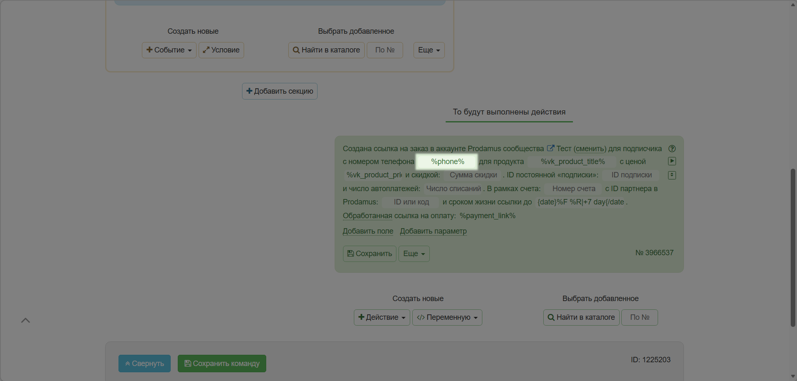
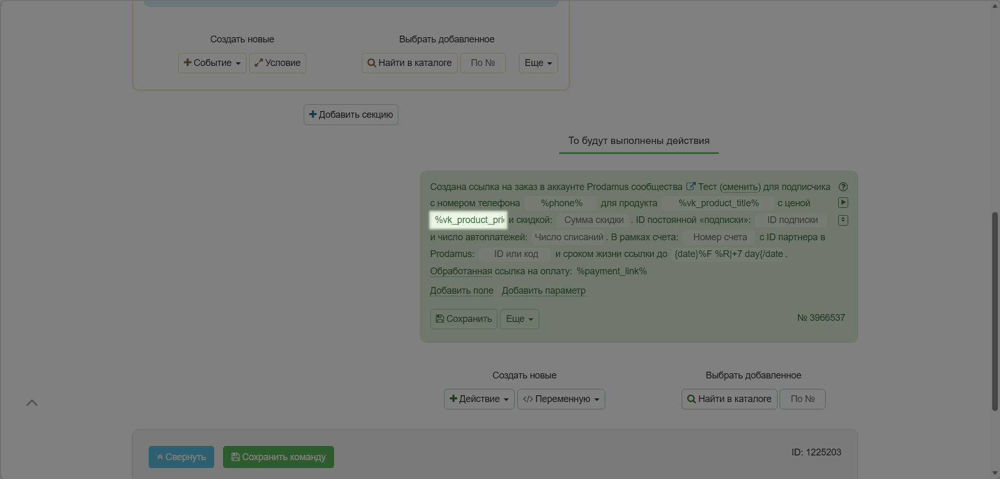
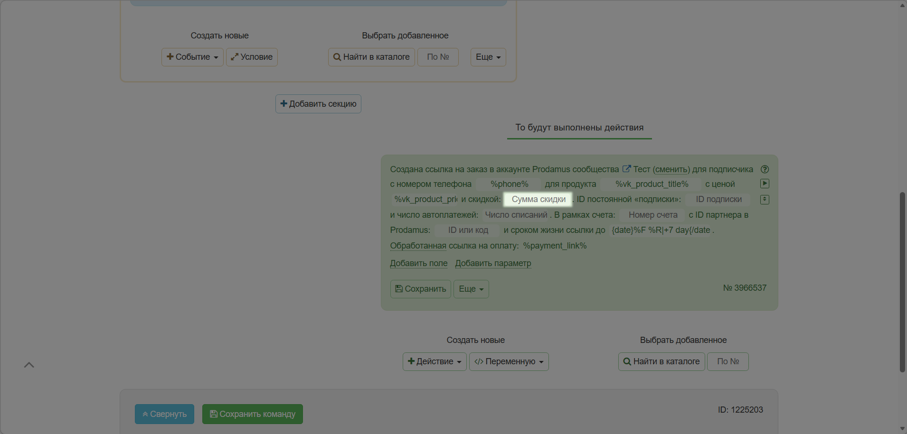
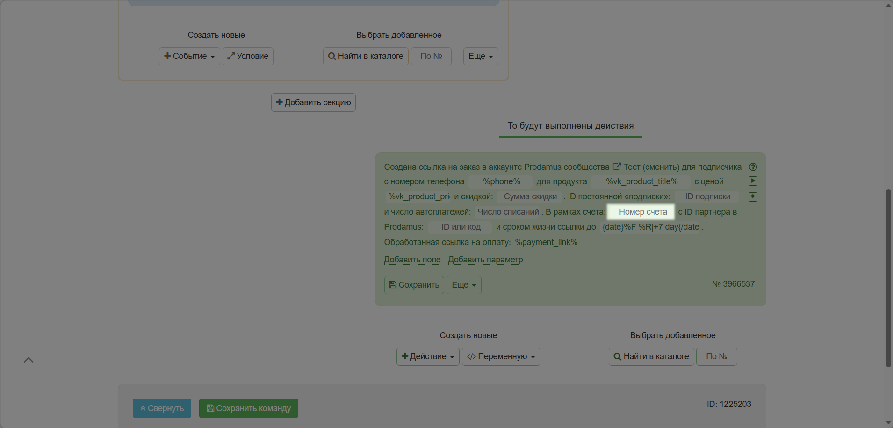
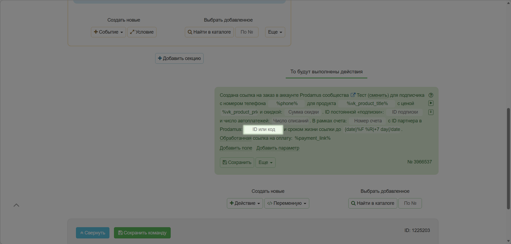
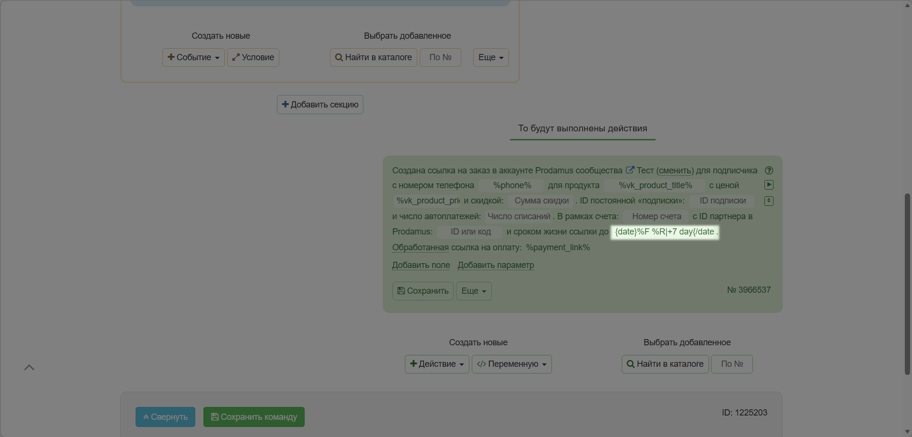
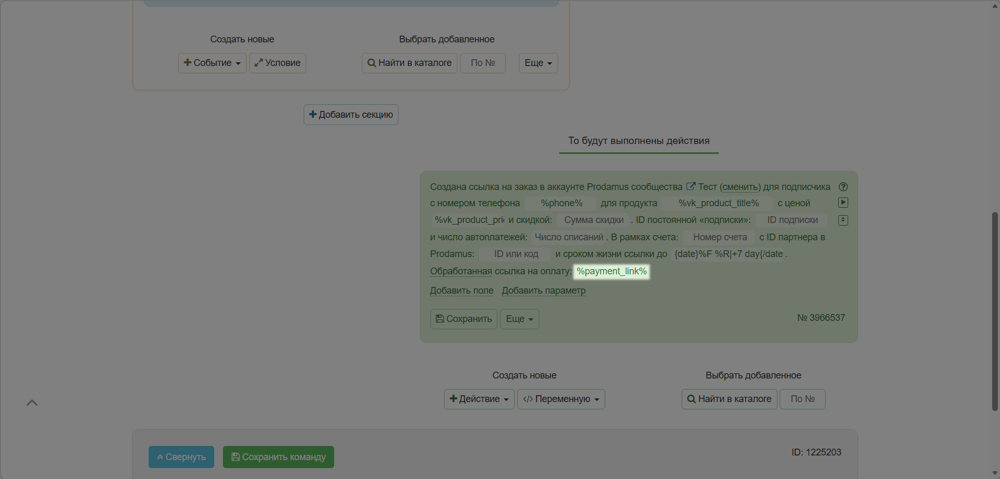
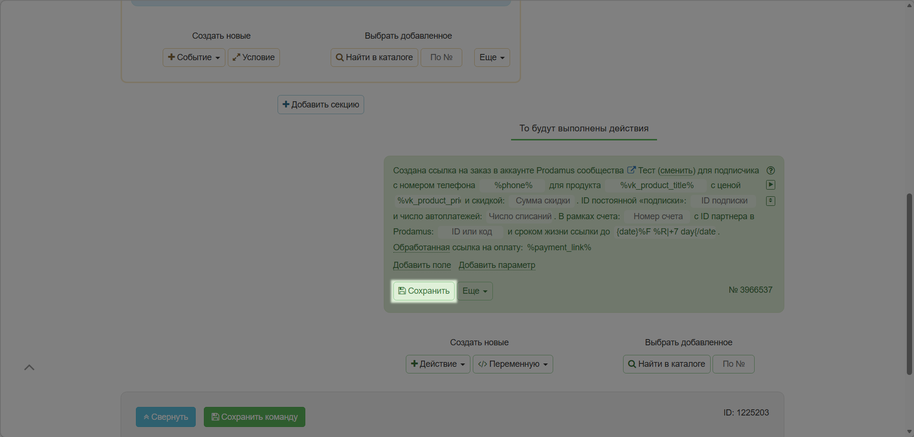
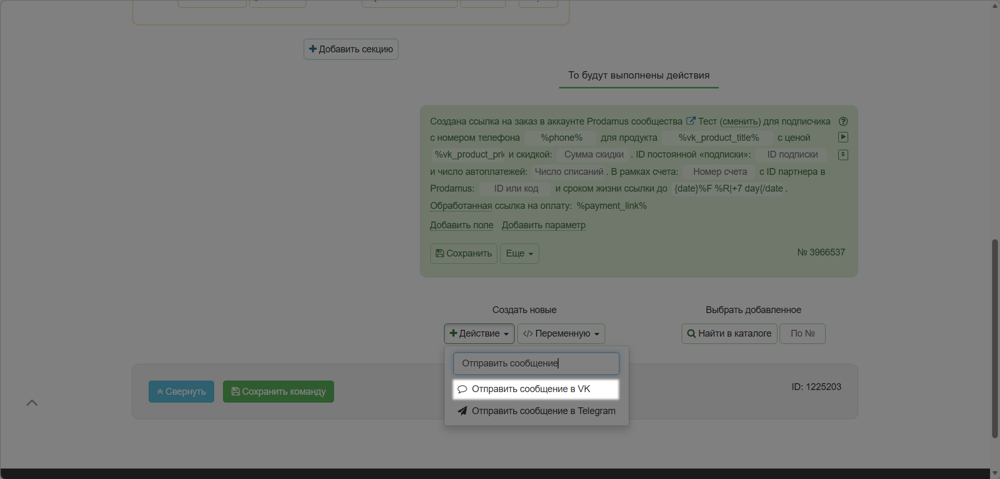
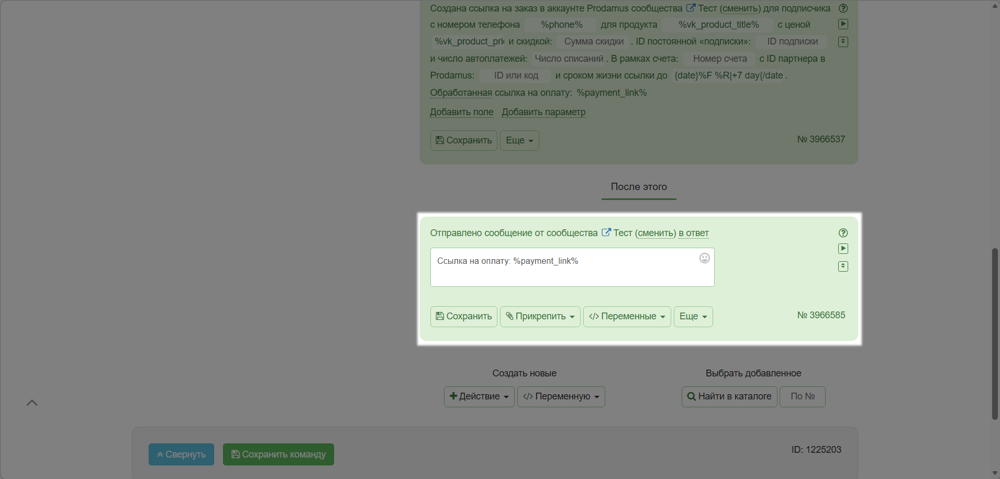

# Автопилот

Автопилот - это конструктор автоворонок, чат-ботов, игр

**Посмотреть другие инструкции к сервису Автопилот можно** [**здесь**](https://vk.com/@skyautome-instructions)**.**

* [Интеграция с Автопилотом](/broken/pages/-M5pY1NTHxa1GIEfCZBV#nastroika-integracii)
* [Настройка команды "Оплата"](/broken/pages/-M5pY1NTHxa1GIEfCZBV#perekhodim-k-nastroike-sobytiya-oplata-v-servise-avtopilot)

### Настройка интеграции

1\. Перейдите на сайт конструктора по адресу [https://skyauto.me/](https://skyauto.me/) и нажмите кнопку “Войти через Вконтакте”

<figure><figcaption></figcaption></figure>

2\. Перейдите в раздел “Сообщества”

<figure><figcaption></figcaption></figure>

3\. Откроется список сообществ, в которых вы являетесь администратором.&#x20;

Напротив нужного вам сообщества нажмите кнопку  “Настройки”

<figure><figcaption></figcaption></figure>

4\. В открывшемся окне на вкладке “Интеграции” найдите раздел Prodamus

<figure><figcaption></figcaption></figure>

5\. И заполните следующие поля:

1\) Имя аккаунта (адрес платежной страницы)

* Откройте канал продаж, который хотите интегрировать с Автопилот
* Скопируйте адрес платежной страницы

<figure><figcaption></figcaption></figure>

У вас будет ссылка вида: **`https://edu2.payform.ru/`**

Удалите `“https://”` и `“.payform.ru/”`. У вас останется только имя аккаунта типа “edu2”

&#x20;Запишите его в поле “Имя аккаунта”

<figure><figcaption></figcaption></figure>

2\) Секретный ключ:

* Откройте канал продаж, который хотите интегрировать с Автопилот
* Перейдите в раздел «Интеграции»&#x20;
* Нажмите сгенерировать ключ

<figure><figcaption></figcaption></figure>

Скопируйте и сохраните сгенерированный ключ.


**Обратите внимание!** После закрытия модального окна просмотр ключа будет недоступен.&#x20;


<figure><figcaption></figcaption></figure>

И вставьте в поле “Секретный ключ”

<figure><figcaption></figcaption></figure>

3\) Webhook URL - в эту строку не нужно вносить изменений.

Откройте нужный канал продаж и перейдите в раздел «Уведомления».

<figure><figcaption></figcaption></figure>

* Включите тумблер «Уведомления о разовых оплатах».&#x20;
* Вставьте адрес, полученный из поля Webhook URL
* Поставьте галочку в поле «Заказ оплачен»
* Сохраните изменения.

<figure><figcaption></figcaption></figure>

4\) Обязательно нажмите на кнопку “Сохранить”.&#x20;

<figure><figcaption></figcaption></figure>

6\. Переходим в следующую вкладку “Приложение сообщества” и устанавливаем приложение Автопилот в нужное нам сообщество

**Готово! Предварительная настройка завершена.**&#x20;

### **Переходим к настройке события “Оплата” в сервисе Автопилот.**&#x20;

1. Перейдите в раздел “Сообщества” и далее “Команды”

<figure><figcaption></figcaption></figure>

2. Нажмите на кнопку “Добавить команду”

<figure><figcaption></figcaption></figure>

3. Сейчас мы будем настраивать формирование ссылки на оплату (для клиента) на примере события, когда клиент написал продавцу:

Необходимо, чтобы эти сообщения от клиента попадали именно в сообщения вашего сообщества, а не администратору группы.&#x20;

Для этого включите раздел “Сообщения” в настройках вашего сообщества

<figure><figcaption></figcaption></figure>

4. Далее переходим в список наших подключенных сообществ в сервисе Автопилот по ссылке [https://skyauto.me/groups](https://skyauto.me/groups)

И создаем команду с названием “Написал продавцу”:

<figure><figcaption></figcaption></figure>

Обязательно сохраните команду! 

5. По умолчанию команда выключена. Нам необходимо ее включить, кликнув по этой кнопке.&#x20;

<figure><figcaption></figcaption></figure>

Теперь кликните мышкой по области команды, чтобы развернуть настройки события.

Далее кликните на кнопку “+Событие”.&#x20;

<figure><figcaption></figcaption></figure>

Выберите событие “Написал сообщение”

<figure><figcaption></figcaption></figure>

И у вас откроется область настройки

<figure><figcaption></figcaption></figure>

Дальше будем заполнять поля:

1. &#x20;Сообщество, на которое вы подключаете событие
2. Поле “Текст сообщения” оставляем пустым. Это значит, что бот будет реагировать на сообщения с любым текстом.
3. Выбираем в поле значение “С товаром”
4. Далее нам необходимо задать товар, в ответ на сообщение с которым мы хотим отправить ссылку на оплату.&#x20;

<figure><figcaption></figcaption></figure>


Нельзя вводить в данное поле более одного ID товара. Сколько у вас будет товаров, столько команд (синее поле) вы должны подключить.


Для того, чтобы вставить ID товара, необходимо скопировать ссылку на товар из группы сообщества вк:

<figure><figcaption></figcaption></figure>

И вставить в поле “Ссылка”


Внимание! ID товара формируется из вашей ссылки автоматически! Для этого достаточно вставить ссылку и кликнуть по любой области ВНЕ этого поля


Далее нажимаем “Сохранить”

<figure><figcaption></figcaption></figure>

И переходим к следующему окну “То будет сделано” и нажимаем кнопку “+Действие”:

<figure><figcaption></figcaption></figure>

Далее выберите из списка действие “Создать заказ в Продамусе”. Это нужно для того, чтобы сформировать ссылку на оплату.

<figure><figcaption></figcaption></figure>

И затем заполняем поля:

1. Сообщество для которого вы производите настройки

<figure><figcaption></figcaption></figure>

2. Указываем номер телефона подписчика, через переменную&#x20;

| %phone% |
| ------- |

&#x20;Номер телефона в системе будет взят из профиля подписчика (если он указал свой номер)

<figure><figcaption></figcaption></figure>

3. Указываем название товара, который хочет купить пользователь через переменную&#x20;

| %vk\_product\_title% |
| -------------------- |

Для того, чтобы все получилось верно, товар должен быть указан в разделе сообщества “Товары”

<figure><figcaption></figcaption></figure>

4. Указываем цену товара, через переменную&#x20;

| %vk\_product\_price% |
| -------------------- |

&#x20;Параметр также берется из раздела сообщества “Товары”

<figure><figcaption></figcaption></figure>

5. Указываем сумму скидки в рублях. Цена будет выставлена клиенту с учетом скидки, и это отобразится в платежном кабинете Prodamus.&#x20;

Это не обязательное поле. Можно оставить пустым.&#x20;

<figure><figcaption></figcaption></figure>

6. Номер счета формируется автоматически, поэтому поле можно оставить пустым.&#x20;

<figure><figcaption></figcaption></figure>

7. Если это партнерская продажа, указываем ID партнера в Prodamus через переменную. Если нет партнера, оставьте поле пустым.

| %ref% |
| ----- |

<figure><figcaption></figcaption></figure>

8. Срок жизни ссылки на оплату. Установлено значение по умолчанию равное неделе. После истечения срока ссылка работать не будет.&#x20;

Если вы хотите сделать ссылку бессрочной, то удалите значение по умолчанию и оставьте поле пустым.&#x20;

<figure><figcaption></figcaption></figure>

9. Шифрование ссылки на оплату через переменную&#x20;

| %payment\_link% |
| --------------- |

<figure><figcaption></figcaption></figure>

10. Сохраняем изменения

<figure><figcaption></figcaption></figure>

Здесь же создаем еще одно действие “Написать сообщение”

<figure><figcaption></figcaption></figure>

Этим действием мы отправим сообщение клиенту, который нам написал со ссылкой на оплату.&#x20;

Пишем в поле произвольный текст и переменную

| %payment\_link% |
| --------------- |

<figure><figcaption></figcaption></figure>

И обязательно сохраняем настройки действия и команды. 

Готово! Настройка завершена.&#x20;

Подобным образом вы можете осуществить полный цикл автоматической коммуникации с клиентом. Посмотреть инструкции к сервису Автопилот можно [здесь](https://vk.com/@skyautome-instructions).


Информация носит исключительно справочный характер и не является офертой. С актуальной редакцией оферты и тарифами Вы можете ознакомиться в разделе "[Документы](https://prodamus.ru/documents)".

