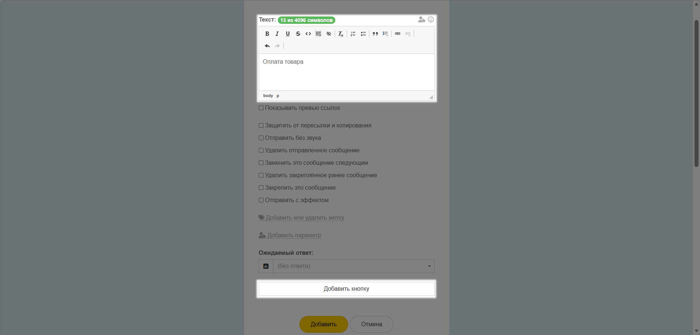
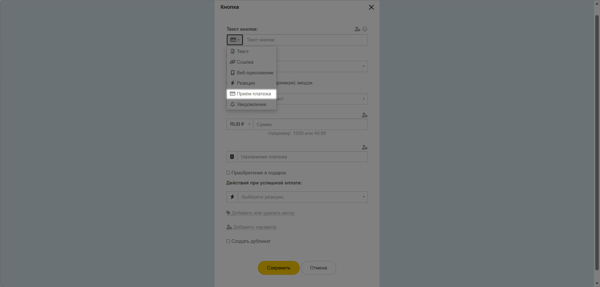
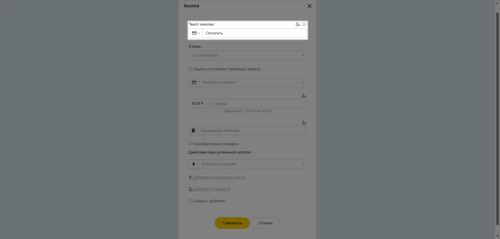
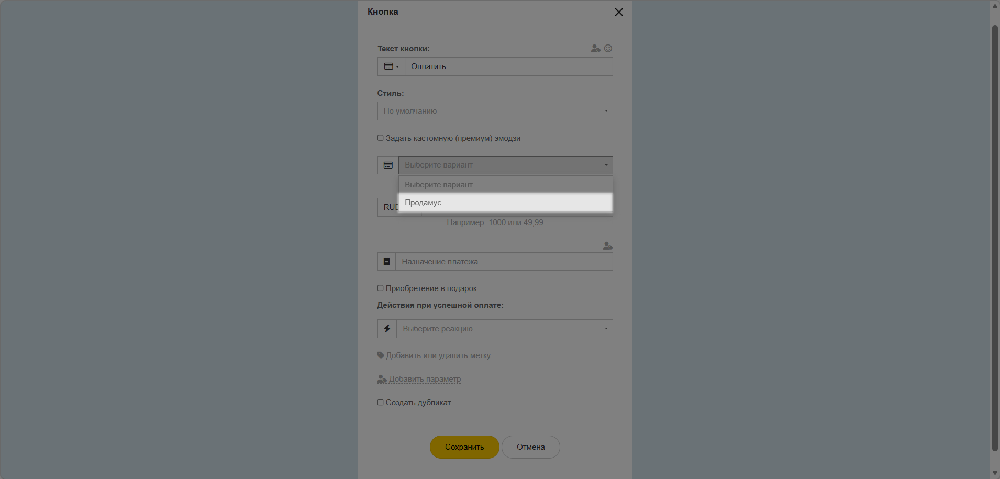
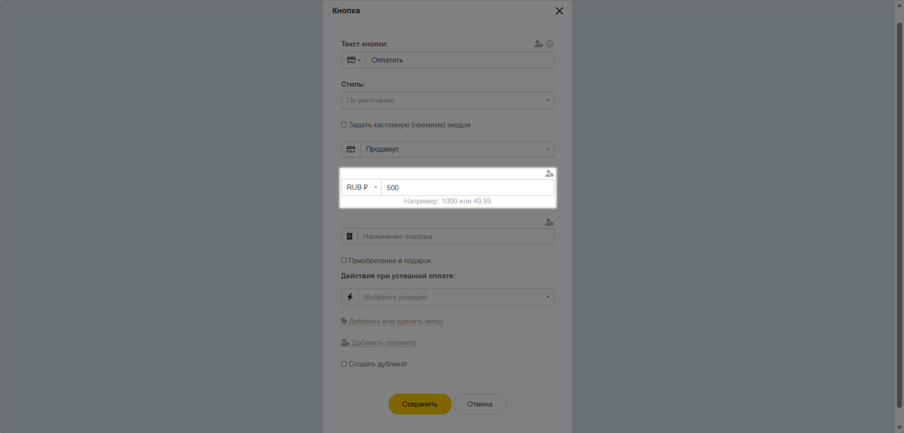
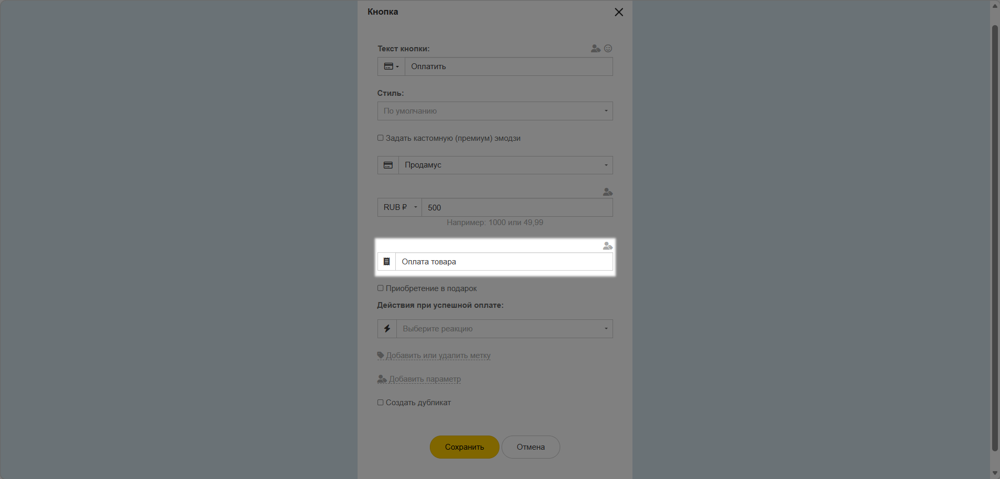
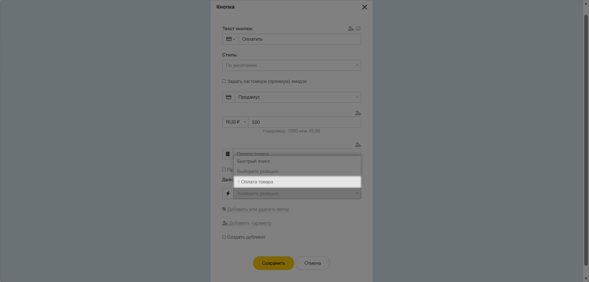
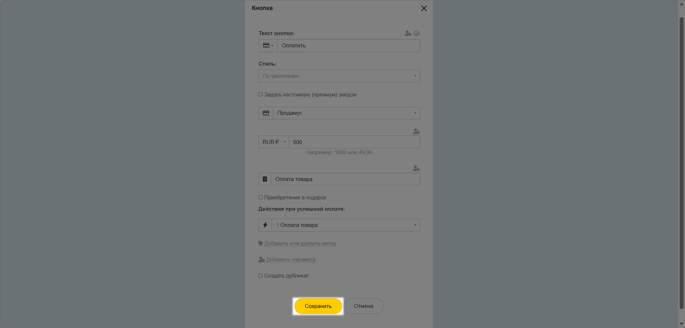
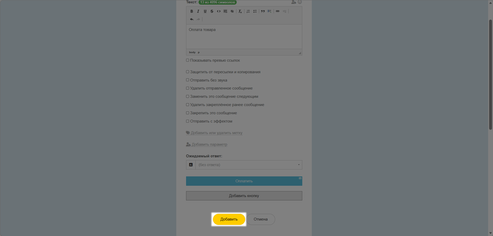
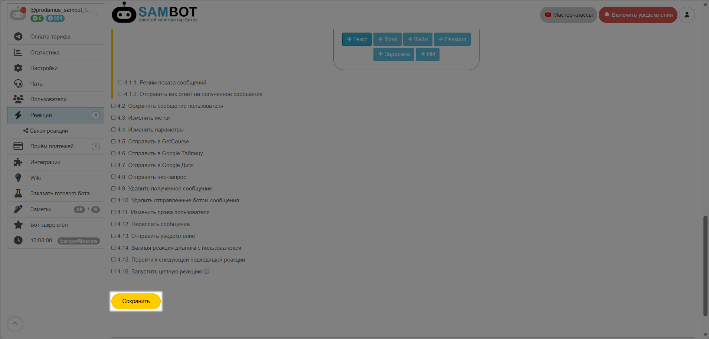

# SamBot

Sambot — это платформа для создания чат-ботов, автоворонок и автоматизации бизнес-процессов. Вы можете подключить к сервису интеграцию с платежными системами и принимать оплату от клиентов через бота. Ниже — инструкция, как всё настроить.


При [регистрации](https://connect.prodamus.ru/?ref=SAMBOT) в Продамусе, можете указать промокод SAMBOT для скидки 2000 рублей &#x20;


### 1. Собираем данные на стороне Продамуса.

👉 [Инструкция: как авторизоваться на платёжной странице](https://help.prodamuspay.ru/)

Для настроек в системе SamBot нам понадобятся данные:\
1\) Адрес платежной страницы:

* Откройте канал продаж, который хотите интегрировать с SamBot
* Скопируйте адрес платежной страницы

<figure><figcaption></figcaption></figure>

2\) Секретный ключ вашей формы:

* Откройте канал продаж, который хотите интегрировать с SamBot
* Перейдите в раздел «Интеграции»&#x20;
* Нажмите сгенерировать ключ

<figure><figcaption></figcaption></figure>

Скопируйте и сохраните сгенерированный ключ.


**Обратите внимание!** После закрытия модального окна просмотр ключа будет недоступен.&#x20;


<figure><figcaption></figcaption></figure>

### 2. Настройки платежного метода в SamBot

Перейдите в раздел Приём платежей и добавьте новый способ приёма платежей.

<figure><figcaption></figcaption></figure>

* Выберите в качестве Платёжной системы Prodamus.

<figure><figcaption></figcaption></figure>

* Укажите Заголовок на своё усмотрение.

<figure><figcaption></figcaption></figure>

* Укажите URL-адрес платёжной формы, который вы ранее скопировали

<figure><figcaption></figcaption></figure>

* Укажите Секретный ключ, который вы ранее скопировали

<figure><figcaption></figcaption></figure>

* Выберите нужную валюту

<figure><figcaption></figcaption></figure>

* Выберите автоматическую обработку платежей.

<figure><figcaption></figcaption></figure>

* Нажмите кнопку "Добавить".

<figure><figcaption></figcaption></figure>

### 3. Настройка Реакции для отправки оплаты

Перейдите в ту Реакцию, которая должна запустить приём оплаты через систему Продамус.

<figure><figcaption></figcaption></figure>

* Добавьте текст призывы к действию.

<figure><figcaption></figcaption></figure>

* Добавьте кнопку с призывом к действию.

<figure><figcaption></figcaption></figure>

Введите текст сообщения и нажмите "Добавить кнопку"

<figure><figcaption></figcaption></figure>

Выберите тип кнопки (слева от текста кнопки)

<figure><figcaption></figcaption></figure>

* Укажите текст на кнопке.

<figure><figcaption></figcaption></figure>

* Выберите из имеющихся у вас способов оплаты тот, который вы настроили на систему Продамус.

<figure><figcaption></figcaption></figure>

* Укажите сумму оплаты.

<figure><figcaption></figcaption></figure>

* Укажите назначение платежа.

<figure><figcaption></figcaption></figure>

* Выберите Реакцию, которая должна запуститься при успешной оплате.

<figure><figcaption></figcaption></figure>

* При необходимости можете назначить покупателю метки или указать данные в персональные параметры.
* Сохраните настройки

<figure><figcaption></figcaption></figure>

* Нажмите кнопку "Добавить"

<figure><figcaption></figcaption></figure>

* Сохраните настройки Реакции

<figure><figcaption></figcaption></figure>

Обязательно самостоятельно протестируйте оплату через бота!

Готово! Теперь Продамус готов принимать платежи в сервисе SamBot!


Информация носит исключительно справочный характер и не является офертой. С актуальной редакцией оферты и тарифами Вы можете ознакомиться в разделе "[Документы](https://prodamus.ru/documents)".

