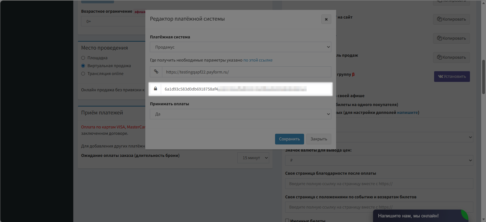
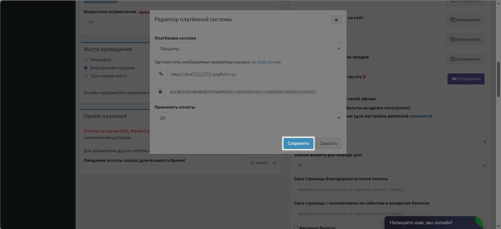
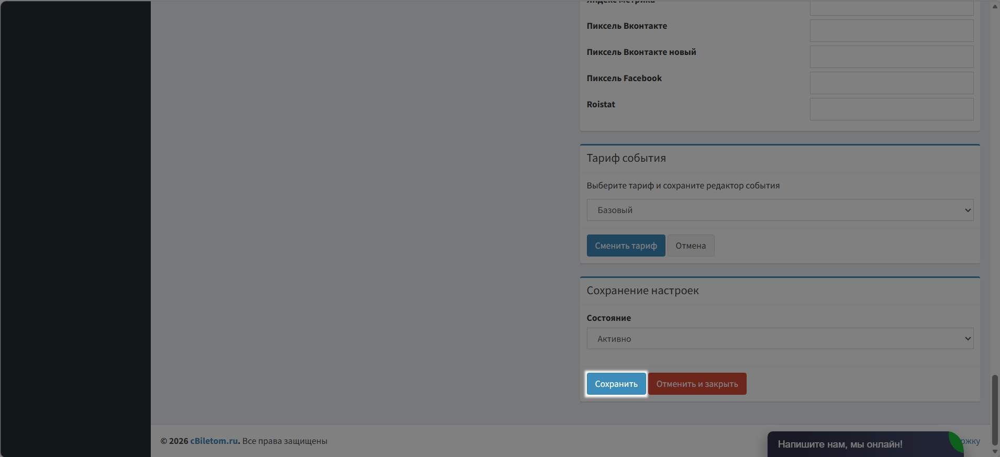

# CBiletom

**Cbiletom.ru** — это онлайн-сервис для покупки, продажи и переоформления билетов на концерты, в театры, на спортивные события и фестивали. Вы можете подобрать билеты прямо с телефона без очередей и посредников: фильтровать по дате, ценовому диапазону, сектору зала, а также предлагать свои билеты другим пользователям. Сервис интегрируется с популярными платежными системами, электронными билетами и API концертных площадок. Ниже — инструкция по настройке.

### Шаг 1. Собираем данные и производим настройки на стороне Продамуса&#x20;

👉 [Инструкция: как авторизоваться на платёжной странице](https://help.prodamuspay.ru/)

Для настроек в системе CBiletom нам понадобятся данные:\
1\) Адрес платежной страницы:

* Откройте канал продаж, который хотите интегрировать с CBiletom
* Скопируйте адрес платежной страницы

<figure><figcaption></figcaption></figure>

2\) Секретный ключ вашей формы:

* Откройте канал продаж, который хотите интегрировать с CBiletom
* Перейдите в раздел «Интеграции»&#x20;
* Нажмите сгенерировать ключ

<figure><figcaption></figcaption></figure>

Скопируйте и сохраните сгенерированный ключ.


**Обратите внимание!** После закрытия модального окна просмотр ключа будет недоступен.&#x20;


<figure><figcaption></figcaption></figure>

Далее добавим в наш платежный кабинет - URL адрес для уведомлений об оплате.

Откройте нужный канал продаж и перейдите в раздел «Уведомления».

<figure><figcaption></figcaption></figure>

* Включите тумблер «Уведомления о разовых оплатах».&#x20;
* Вставьте адрес [https://cbiletom.ru/api/payments/prod.php](https://cbiletom.ru/api/payments/prod.php)
* Поставьте галочку в поле «Заказ оплачен»
* Сохраните изменения.

<figure><figcaption></figcaption></figure>

### Шаг 2. Настройка интеграции на стороне CBiletom

Перейдите на страницу «События», отредактируйте нужное Вам событие или создайте новое

<figure><figcaption></figcaption></figure>

Введите название вашего события

<figure><figcaption></figcaption></figure>

Выберите дату вашего события

<figure><figcaption></figcaption></figure>

Настройте время проведения события

<figure><figcaption></figcaption></figure>

Выберите место проведения события

<figure><figcaption></figcaption></figure>

Нажмите на кнопку «Добавить тип оплаты»

<figure><figcaption></figcaption></figure>

Выберите «Продамус» в поле «Платежная система»&#x20;

<figure><figcaption></figcaption></figure>

Вставьте ссылку на платежную форму, полученную в личном кабинете Продамуса

<figure><figcaption></figcaption></figure>

В поле «Секретный ключ» вставьте секретный ключ, созданный в личном кабинете Продамуса

<figure><figcaption></figcaption></figure>

Нажмите кнопку «Сохранить»

<figure><figcaption></figcaption></figure>

Сохраните настройки события

<figure><figcaption></figcaption></figure>

Готово! Теперь Продамус готов принимать платежи в сервисе CBiletom!


Информация носит исключительно справочный характер и не является офертой. С актуальной редакцией оферты и тарифами Вы можете ознакомиться в разделе "[Документы](https://prodamus.ru/documents)".

