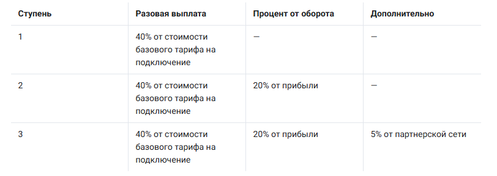

# Инструкция по использованию личного кабинета партнера Prodamus

Личный кабинет партнера Prodamus — это центр управления вашей партнерской деятельностью, где отслеживаются промокоды, рефералы и начисленное вознаграждение.

### Основные разделы

#### **Промокоды**

>)

Раздел содержит список всех ваших промокодов и детальную статистику по каждому:

* Количество переходов по реферальной ссылке
* Оставленные заявки клиентами
* Оплаченные подключения к Prodamus
* Данные для анализа эффективности каждого промокода

Вы можете создавать несколько промокодов для разных каналов продвижения и отслеживать, какой приносит больше рефералов.

#### **Рефералы**

>)

В этом разделе отображается информация о привлеченных клиентах:

#### **Основная статистика «Виджет»:**

• Общее количество рефералов (новые и старые) • Доход за текущий месяц • Ваша текущая ступень в программе

**Таблица рефералов содержит:**

• ФИО реферала и контактные данные • Дату создания и подключения аккаунта • Статус подключения (Подключён, Ожидаем оплаты, Отказ) • Статус активности (Активен, Неактивен, Спящий, Нет транзакций) • Сумму дохода от реферала • Промокод, по которому подключился клиент

**Статусы активности рефералов:**

• Активен — есть доход за текущий месяц • Неактивен — нет дохода более 1 месяца • Спящий — нет дохода более 3 месяцев • Нет транзакций — клиент не совершил ни одной транзакции

#### **Начисления**

>)

Раздел показывает детализацию вознаграждений по месяцам:

**Отображаемая информация:**

* Период начисления
* Подключения (разовые выплаты за новых клиентов)
* Транзакции (процент от оборота клиентов)
* Итоговая сумма вознаграждения
* Статус выплаты

**Статусы начислений:**

* Формируется — текущий месяц, итоговая сумма еще определяется
* Подтвержден — начисления рассчитаны и ожидают выплаты (с 1 по 8 число следующего месяца)
* Выплачен — вознаграждение отправлено партнеру

#### **Чат партнеров**

Раздел для коммуникации с другими участниками партнерской программы и менеджерами Prodamus.

#### **Инструменты фильтрации и анализа**

**Фильтры рефералов**\*\*:\*\*

* По статусу подключения
* По статусу активности
* По дате детализации
* По промокоду

**Дополнительные опции:**

* Сортировка по различным параметрам
* Экспорт данных
* Поиск конкретного реферала

#### **Система ступеней**

<figure><figcaption></figcaption></figure>

#### **Система выплат**


**ВАЖНО!** Вознаграждения выплачиваются ежемесячно, после подписания вами актов через ЭДО (электронный документооборот):

👉 [Как работать с EasyDocs: регистрация, подписание актов и получение выплат](https://help.prodamus.ru/partnyorskaya-programma/kak-rabotat-s-easydocs-registraciya-podpisanie-aktov-i-poluchenie-vyplat)


1. С 1 по 8 число — подсчет начислений за прошлый месяц
2. После подтверждения — формирование платежа
3. Выплата партнеру после подписания документов


**Важно:** Для получения выплат необходимо быть зарегистрированным как самозанятый, ИП или ООО.


#### **Подсказки и пояснения**

В интерфейсе присутствуют иконки с вопросительными знаками — при наведении отображаются подсказки о назначении каждого элемента.

#### **Как эффективно использовать кабинет**

Регулярно проверяйте:

* Статистику промокодов для оценки эффективности каналов
* Статус рефералов для работы с неактивными клиентами
* Начисления для контроля ожидаемых выплат

**Анализируйте данные:**

* Какие промокоды приносят больше конверсий
* Сколько рефералов находятся в статусе "Спящий", “Неактивный”
* Динамику дохода по месяцам

Личный кабинет доступен по адресу [partner.prodamus.ru](http://partner.prodamus.ru/) после заключения партнерского договора.
