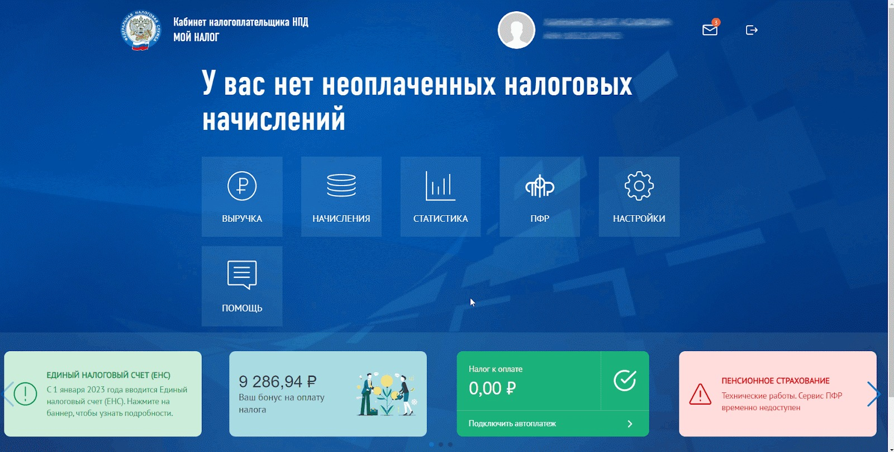

# Как подать заявку на подключение кабинета самозанятого

Prodamus поддерживает интеграцию с приложением «Мой налог», которая позволяет самозанятым автоматически передавать данные о продажах в ФНС без ручного ввода. Это экономит время и снижает риск ошибок при учёте доходов. Ниже рассказали, как всё настроить.&#x20;

### Шаг 1. Подача заявки в личном кабинете Prodamus

Перейдите в раздел «Настройки компании»

<figure><figcaption></figcaption></figure>

Откройте вкладку «Самозанятость».

<figure><figcaption></figcaption></figure>

Нажмите кнопку «Отправить запрос».&#x20;

<figure><figcaption></figcaption></figure>

После нажатия кнопки вы увидите на её месте уведомление о том, что заявка ожидает подтверждения. Это значит, что можно переходить к следующему шагу настройки интеграции.

<figure><figcaption></figcaption></figure>

### Шаг 2. Настройка на стороне приложения «Мой налог»

Откройте сайт или приложение «Мой налог». В разделе «Уведомления» найдите запрос на интеграцию от Prodamus.

<figure><figcaption></figcaption></figure>

<figure><figcaption></figcaption></figure>

Перейдите в Настройки → Партнёры.

<figure><figcaption></figcaption></figure>

Откройте запрос на интеграцию и нажмите «Подтвердить».

<figure><figcaption></figcaption></figure>


Важно:&#x20;

Если на ту же карту, что привязана к «Моему налогу», вы получаете выплаты от Prodamus, рекомендуется отключить банковскую выгрузку платежей в приложении «Мой налог».

Иначе возможна двойная передача информации о доходе:

1. Prodamus отправит данные о продаже
2. Банк повторно передаст информацию в «Мой налог» как выплату от юрлица
3. В итоге получится дубль и увеличенный налог


Чтобы отключить выгрузку через банк:

* Зайдите в приложение или на сайт «Мой налог»
* Перейдите: Настройки → Партнёры → Подключённые
* Найдите интеграцию с банком → нажмите «Отключиться»

<figure><figcaption></figcaption></figure>

### Шаг 3. Проверка подключения

Вернитесь в личный кабинет Prodamus и проверьте статус интеграции. Если всё прошло успешно, вы увидите надпись «Подключено».&#x20;

<figure><figcaption></figcaption></figure>

Если у вас что-то не получилось или возникли вопросы — обратитесь в техподдержку Prodamus через [Telegram-бот](https://t.me/prodamus_bot). Мы поможем всё настроить.&#x20;
